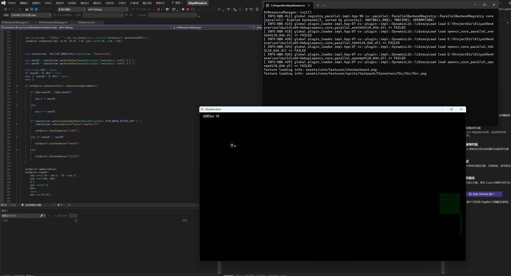
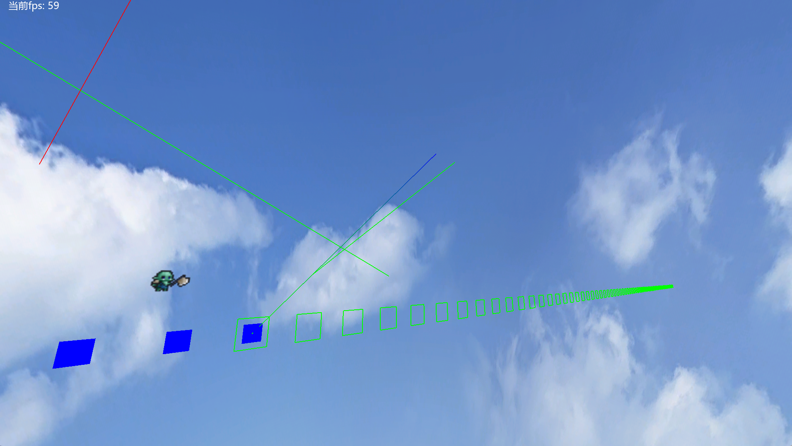
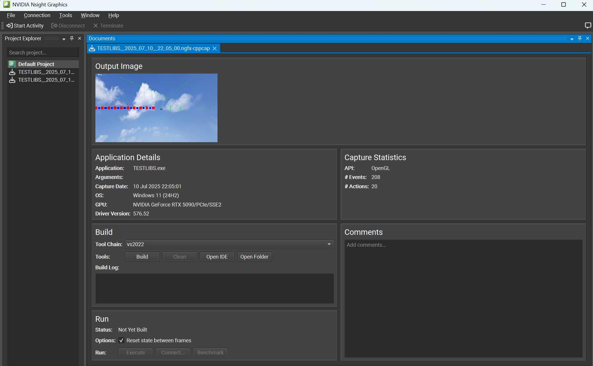

## AliyatRenderer
---
### Project Architecture
This project use the "cmake + vcpkg"

	--Core
		--EngineCore
		--ModuleManager
		--MemoryPool
		--EventSystem
		--ResourceManager
		--Renderer
		--Network
		--Physics
		--InputSystem
		--SceneManager
		--Logger (Not yet supported, should use spdlog?)
		//some system header files
### Project Constraints
1. Regarding the uniformity of project naming
 
	Class name prefix

		AY Core Components
		UT tool component
		I Interface/Abstract Class
		ST structure

    Code Style

		Class name (without prefix) with large camel hump
		Member functions and variables use small humps
		Private variables use underscore prefix
### Project Dependence
Before execute this program, preparing these packages:

	1. Boost::asio
		Network && TimerManager(Unused)
	2. Opencv4
		Renderer...(Picture loaded)
	3. Glm
		Renderer...(Math)
	4. nlohmann json
		...(Serialize)
	5. freetype
		Renderer(Font loaded)
	6. openssl
		Network
	7. Boost::property_tree
		all(may replace nlohmann)
	8. Box2d && PhysX
		Physics
	9. libarchive
		may be Network ( use zstd when compress network msg)

Run the following commands:

	vcpkg install boost-asio boost-system boost-property-tree opencv4 nlohmann-json box2d physx libarchive
### Project Progress
1. | Description               | Picture                                                                 |
|--------------------|----------------------------------------------------------------------|
| This Orc can move, turn, and attack, and it receives the left joystick axis value input from Gmaepad, as well as the "X" as the attack key. Of course, it is currently only an animation
        | 
		| The system now supports 3D camera functionality and equirectangular skyboxes, but there's a rendering issue with 2D sprites - they only appear at z=0 depth and remain fixed in screen space, causing them to stay in place even when the 3D camera moves.
		| 
		| The current architecture results in drawing 30000 instantiated graphics in one frame, causing the program to have a frame rate of only about 5fps. It is still unclear whether it is a CPU or GPU limitation, and it is difficult to fix such issues until the module is completed and disconnected from the main thread.
		| 
		|
		|

	
2. Core code lines: 9447
	
	   Use this in powershell under "src/Core/":
	   Get-ChildItem -Recurse -Include *.cpp,*.h,*.cxx,*.hpp | ForEach-Object { (Get-Content $_).Count } | Measure-Object -Sum
3. 