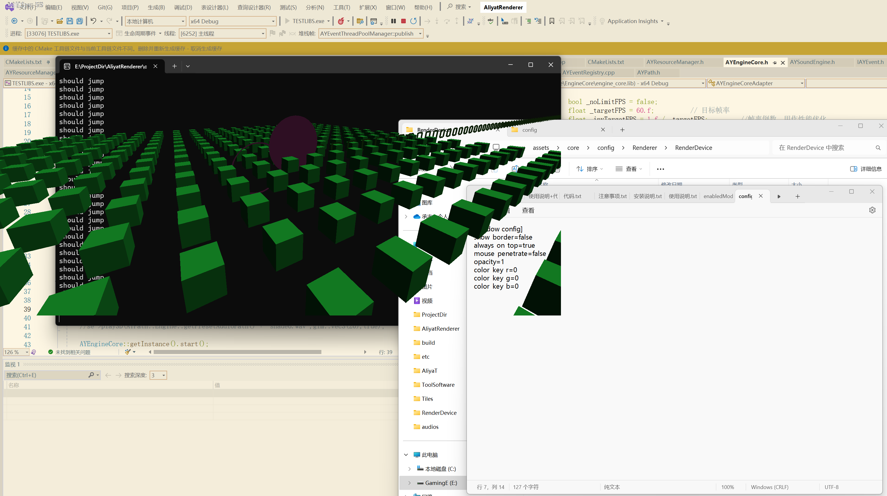
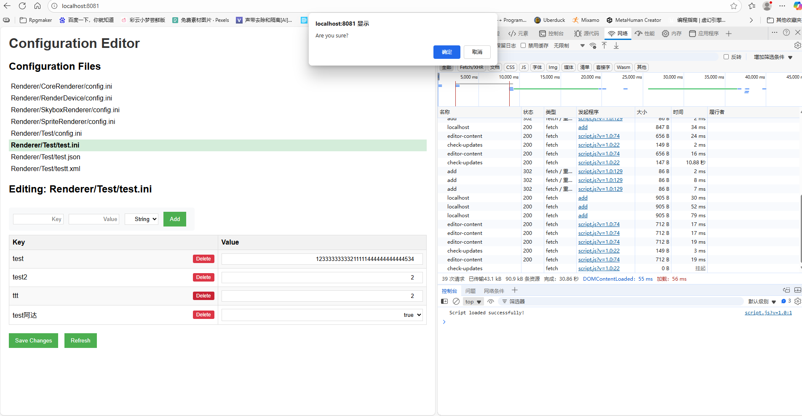
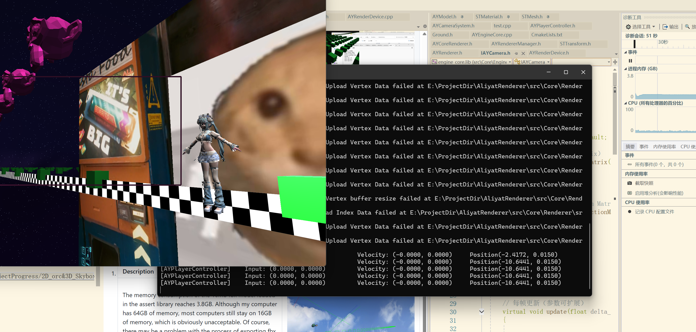
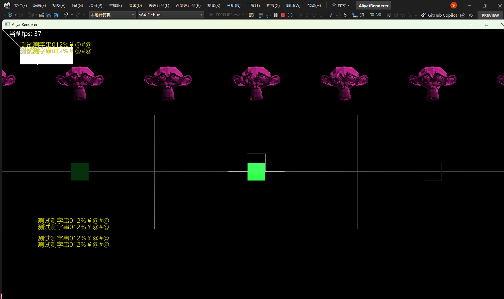

## AliyatRenderer
---
### Project Architecture
This project use the "cmake + vcpkg"

	--Core
		--EngineCore
		--ModuleManager
		--MemoryPool
		--EventSystem
		--ResourceManager
		--SoundEngine
		--Renderer
			--CameraSystem
			--MaterialManager(Logically belong here)
			--TextureManager
		--Network
		--Physics
		--InputSystem
		--SceneManager
		--ECSEngine (Not yet completed)
		--Logger (Not yet supported, should use spdlog?)

### Project Constraints
1. Regarding the uniformity of project naming
 
	Class name prefix

		AY Core Components
		UT tool component
		I Interface/Abstract Class
		ST structure

    Code Style

		Class name (without prefix) with large camel hump
		Member functions and variables use small humps
		Private variables use underscore prefix

	Shader Style

    	uniform variable like: u_projection
		vertex layout variable like: aPos
		fragment in variable like: v_color
### Project Dependence
Large update direction:
	
	Use command as follow:
		cd thirdParty
		git clone https://github.com/bkaradzic/bgfx.cmake.git
		cd bgfx.cmake
		git submodule init
		git submodule update

	Some options may be beneficial to project management,
	such as deleting all sample projects under bgfx

Before execute this program, preparing these packages:

	1. Boost::asio
		Network && TimerManager(Unused)
	2. Opencv4, openal-soft, FFmpeg
		Resource(Texture, Audio, Video)
	3. Glm
		Renderer...(Math)
	4. nlohmann json
		...(Serialize)
	5. freetype
		Renderer(Font loaded)
	6. openssl
		Network
	7. Boost::property_tree
		all(may replace nlohmann)
	8. Box2d && PhysX
		Physics
	9. libarchive
		may be Network ( use zstd when compress network msg)
	10.efsw
		FileWatch
	11.assimp
		model load
	12.bgfx
		multi-platform rendering
	13.soci
		sql

Run the following commands:

	vcpkg install boost-asio boost-system boost-property-tree boost-locale \
              opencv4 openal-soft ffmpeg nlohmann-json box2d physx \
              libarchive glm efsw assimp spdlog cpp-httplib soci \
              soci[mysql] soci[postgresql] soci[sqlite3] soci[odbc]
### Project Progress
1. | Description               | Picture                                                                 |
|--------------------|----------------------------------------------------------------------|
| This Orc can move, turn, and attack, and it receives the left joystick axis value input from Gmaepad, as well as the "X" as the attack key. Of course, it is currently only an animation| |
| The system now supports 3D camera functionality and equirectangular skyboxes, but there's a rendering issue with 2D sprites - they only appear at z=0 depth and remain fixed in screen space, causing them to stay in place even when the 3D camera moves.| |
| The current architecture results in drawing 30000 instantiated graphics in one frame, causing the program to have a frame rate of only about 5fps. It is still unclear whether it is a CPU or GPU limitation, and it is difficult to fix such issues until the module is completed and disconnected from the main thread.| |
| This effect is achieved by setting a native Windows window. If you want to implement it in other engines, you need to find a way to obtain the handle of the Windows window. There seems to be a small flaw. It should have been set as a penetrable switch, but now the default pixel free place will directly penetrate below. At least now it can make desktop pets| |
| Now ConfigResolver can correctly edit files in a multithreaded environment, handle the problem of Chinese encoding, and add file monitoring to automatically update the front page. Maybe the code logic is a bit confusing, but as a small tool, I think it is enough. To quote Todd, "It just work". It will not consider too much performance nor consume too much performance| |
	
2. Core code lines: 17167
	
	   Use this in powershell under "src/Core/":
	   Get-ChildItem -Recurse -Include *.cpp,*.h,*.cxx,*.hpp | ForEach-Object { (Get-Content $_).Count } | Measure-Object -Sum
### Problems to Solve
1. | Description               | Picture                                                                 |
|--------------------|----------------------------------------------------------------------|
| The memory consumption of the 10mb fbx model loaded in the assert library reaches 3.8GB. Although my computer has 64GB of memory, most computers still stay on 16GB of memory, which is obviously unacceptable. Of course, there may be a problem with the process of exporting fbx through pmx| 
| When the device information switches to the 3060+AMD low-end CPU, it is only then that we realize the significant design flaws in the previous architecture. Afterwards, we will fully shift to a specialized multi platform rendering solution to avoid multiple repeated uploads of data| 